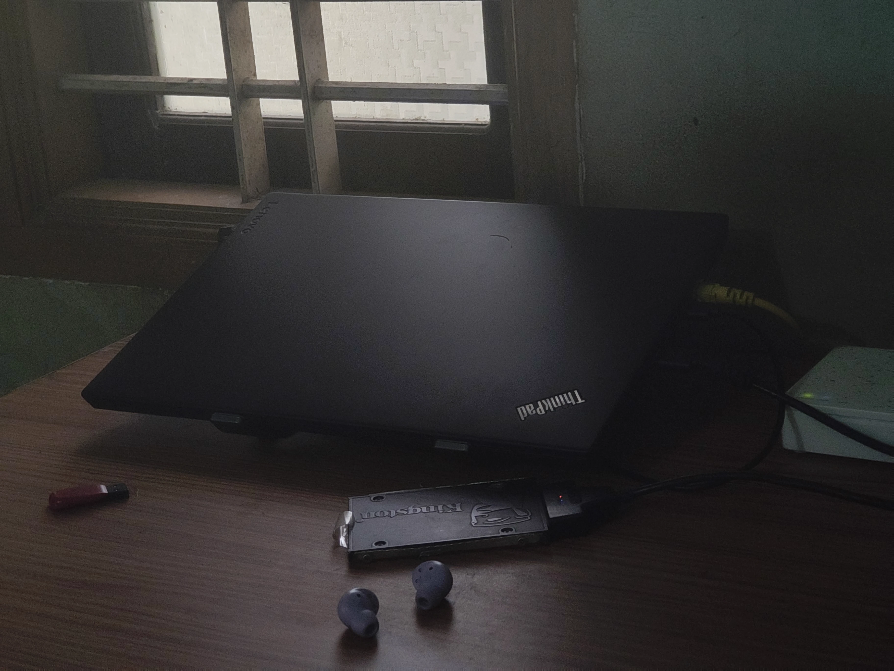
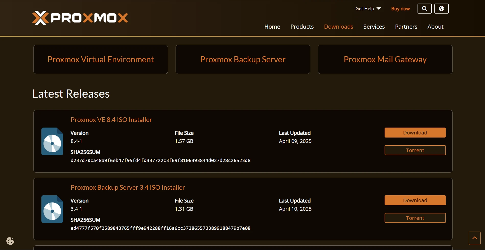
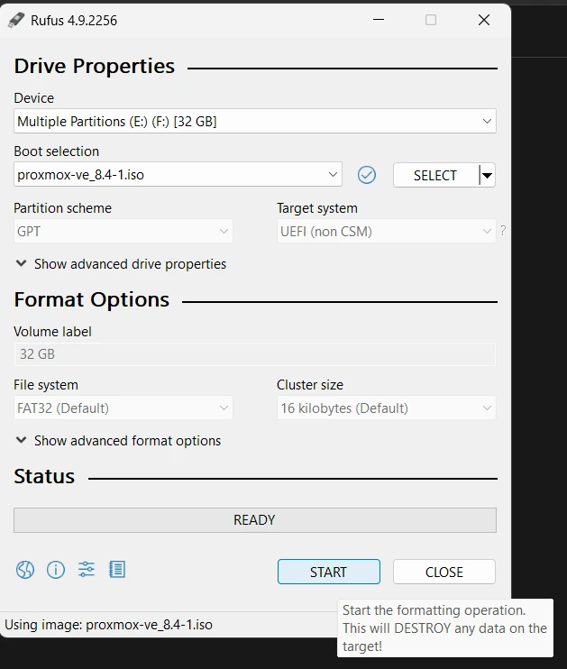
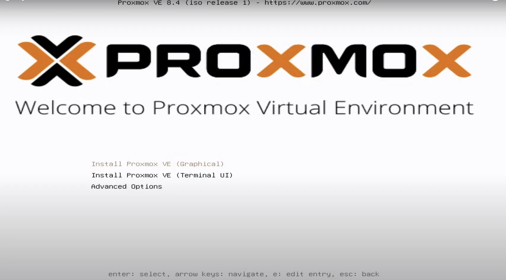
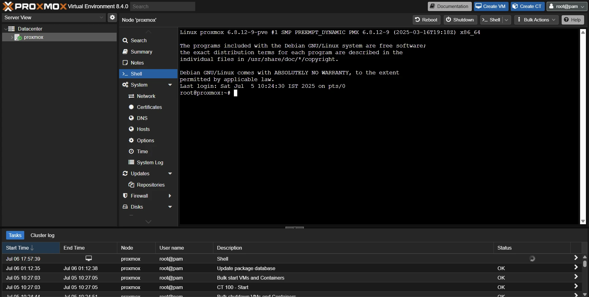

## Introduction

I always wanted a dedicated machine where I could experiment without worrying about breaking my main laptop. Instead of buying an expensive server, I decided to reuse my old **Lenovo ThinkPad T480** and turn it into a Proxmox VE homelab.

In this guide, I'll show you how I installed Proxmox VE, configured storage, fixed common issues, and built a stable setup for running virtual machines and containers. Everything here is based on my own experience, including the mistakes I made and the solutions that worked for me.

Whether you're learning Linux, exploring virtualization, hosting your own services, or building a cybersecurity lab, you don't need expensive hardware to get started. An old laptop and a little curiosity are more than enough.

## Why I Chose the ThinkPad T480

When I decided to build a homelab, I didn't want to spend a lot of money on a dedicated server. Instead, I looked around to see what I already had. My old **Lenovo ThinkPad T480** turned out to be the perfect choice.

Even though it's a few years old, it's still a reliable and capable laptop. The **Intel Core i7-8650U** has enough power to run multiple virtual machines and containers, and upgrading it to **32 GB of RAM** gave me plenty of room to experiment. The SSD is also easy to replace, making future upgrades simple.

Another reason I chose the T480 is that it's affordable and easy to find in the used market. If you're planning to build a budget-friendly homelab, it's one of the best laptops you can start with.

For me, it offered the right balance of performance, reliability, and price. Since I already owned it, I could jump straight into building my homelab without buying any additional hardware.

## Hardware Specifications

Here's the hardware I'm using for this homelab:

- **Laptop:** Lenovo ThinkPad T480
- **Processor:** Intel Core i7-8650U
- **Memory:** 32 GB DDR4 RAM
- **Internal Storage:** 256 GB SSD (Proxmox VE)
- **External Storage:** 256 GB USB 3.0 SSD (VMs, ISO images, templates, and backups)



This setup has been more than enough for running multiple virtual machines and LXC containers. I use the internal SSD for the Proxmox installation, while the external SSD stores virtual machines, ISO images, templates, and backups.

Since the laptop runs 24/7, I keep it plugged in and use a laptop cooling pad during heavy workloads to keep temperatures under control.

## Downloading Proxmox VE

The first step is to download the latest Proxmox VE ISO from the official website.

Visit the official **[Proxmox VE Downloads](https://www.proxmox.com/en/downloads)** page and download the latest **Proxmox VE ISO Installer**. At the time of writing, I'm using the latest stable version available.



Once the download is complete, you're ready to create a bootable USB drive.

## Creating a Bootable USB

To install Proxmox VE, you'll need a USB drive with at least **4 GB** of storage.

I used **[Rufus](https://rufus.ie/)** on Windows to create the bootable USB, but you can also use **[Balena Etcher](https://etcher.balena.io/)** or **[Ventoy](https://www.ventoy.net/)** if you prefer.

1. Insert your USB drive.
2. Open Rufus.
3. Select the downloaded Proxmox VE ISO.
4. Choose your USB drive.
5. Click **Start** and wait for the process to finish.



Once the bootable USB is ready, safely eject it and plug it into your ThinkPad T480.

## Booting from the USB

Now that the bootable USB is ready, plug it into your ThinkPad T480 and turn it on.

As soon as the Lenovo logo appears, press **F12** repeatedly to open the boot menu. From the list of available devices, select your USB drive and press **Enter**.

After a few moments, the Proxmox VE boot menu will appear. Select **Install Proxmox VE (Graphical)** and press **Enter** to begin the installation.



## Installing Proxmox VE

The Proxmox VE installer will guide you through the installation process.

Start by accepting the license agreement, then select the SSD where you want to install Proxmox VE. In my case, I chose the laptop's internal 256 GB SSD.

Next, choose your country, time zone, and keyboard layout.

You'll also be asked to create a **root** password and enter an email address. Make sure to use a strong password, as you'll use it to manage your Proxmox server.

Finally, configure the network settings. If your router provides IP addresses using DHCP, Proxmox will detect them automatically. You can keep the assigned IP address or configure a static IP if you prefer.

After reviewing the settings, click **Install** and wait for the installation to finish. This usually takes around **5–10 minutes**, depending on your hardware.

Once the installation is complete, remove the USB drive and reboot the laptop.

## Accessing the Proxmox Web Interface

Once the installation is complete, remove the USB drive and reboot your laptop.

After the system starts, Proxmox will display the server's IP address on the login screen. It will look something like this:

```text
https://192.168.1.100:8006
```

On another device connected to the same network, open a web browser and enter the displayed address.

Since Proxmox uses a self-signed SSL certificate by default, your browser will display a security warning. This is expected. Click **Advanced** and continue to the website.

You'll now see the Proxmox login page. Log in using the **root** account and the password you created during installation.

- **Username:** `root`
- **Realm:** Linux PAM authentication
- **Password:** The password you set during installation



After logging in, you'll be taken to the Proxmox dashboard, where you can start creating virtual machines, LXC containers, and managing your homelab.

## Configuring the No-Subscription Repository

By default, Proxmox VE uses the **Enterprise Repository** for updates, which requires a paid subscription. Since I'm using the free Community Edition for my homelab, I switched to the **No-Subscription Repository** instead.

When I first ran:

```bash
apt update
```

I received the following error:

```text
E: Failed to fetch https://enterprise.proxmox.com/... 401 Unauthorized
```

This happens because the Enterprise Repository is enabled by default.

For more information, see the official **[Proxmox Package Repositories documentation](https://pve.proxmox.com/wiki/Package_Repositories)**.

Disable the Enterprise repository and enable the No-Subscription repository by running:

```bash
sed -i 's/^deb/#deb/g' /etc/apt/sources.list.d/pve-enterprise.list
echo "deb http://download.proxmox.com/debian/pve bookworm pve-no-subscription" > /etc/apt/sources.list.d/pve-no-subscription.list
apt update
apt full-upgrade -y
```

Once the update is complete, reboot the system if required.

Keeping Proxmox updated ensures you have the latest security patches, bug fixes, and new features.

## Disabling the Ceph Enterprise Repository (Optional)

If you're not planning to use Ceph, it's a good idea to disable its Enterprise repository as well. Otherwise, you'll continue seeing repository errors during updates.

Open the repository file:

```bash
nano /etc/apt/sources.list.d/ceph.list
```

Comment out the Enterprise repository by adding a `#` at the beginning of the line:

```text
#deb https://enterprise.proxmox.com/debian/ceph-quincy bookworm enterprise
```

## Reclaiming the Internal SSD Space

By default, Proxmox creates a separate **LVM-Thin** partition for storing virtual machines.

Since I use an external SSD for all my virtual machines, ISO images, templates, and backups, I didn't need this partition on my internal drive. Instead, I removed it and gave the space back to the root filesystem.

> **⚠️ Warning:** Only run the following commands if you don't have any virtual machines or containers stored in the default `local-lvm` storage. This process permanently removes the LVM-Thin volume.

```bash
lvremove /dev/pve/data
lvresize -l +100%FREE /dev/pve/root
resize2fs /dev/mapper/pve-root
```

This way, the internal SSD is used entirely by the operating system, while the external SSD handles all virtualization workloads.

## Setting Up the External SSD

To keep my system organized, I store all virtual machines, ISO images, templates, and backups on a dedicated external SSD.

First, format the drive and create a mount point.

```bash
mkfs.ext4 /dev/sdb
mkdir /mnt/externalssd
mount /dev/sdb /mnt/externalssd
```

Next, find the drive's UUID.

```bash
blkid /dev/sdb
```

Edit the `fstab` file.

```bash
nano /etc/fstab
```

Add a new entry using your drive's UUID.

```text
UUID=xxxx /mnt/externalssd ext4 defaults 0 0
```

After saving the file, reboot or remount the filesystem.

Finally, add the directory as storage from the Proxmox web interface:

**Datacenter → Storage → Add → Directory**

## Optional: Using LVM-Thin on the External SSD

If you regularly create, clone, or snapshot virtual machines, LVM-Thin is worth using. It saves storage space and makes cloning much faster.

To learn more about the available storage backends, see the official **[Proxmox Storage documentation](https://pve.proxmox.com/wiki/Storage)**.

```bash
wipefs -a /dev/sdb
pvcreate /dev/sdb
vgcreate external-vg /dev/sdb
lvcreate -l 100%FREE -T external-vg/external-thin
```

Once it's created, add it from the Proxmox web interface as **LVM-Thin** storage.

## Preventing the Laptop from Sleeping

Since my ThinkPad runs as a server, I don't want it going to sleep every time I close the lid.

Open the logind configuration file:

```bash
nano /etc/systemd/logind.conf
```

Find the following line and change it to:

```text
HandleLidSwitch=ignore
```

Restart the service:

```bash
systemctl restart systemd-logind
```

Now the laptop will continue running even when the lid is closed.

## Fixing the Console Error

If you see the following error while opening the Proxmox console:

```text
TASK ERROR: command '/usr/bin/termproxy ...' failed: exit code 1
```

Restart the Proxmox proxy service:

```bash
systemctl restart pveproxy
```

This usually fixes the issue immediately.

## Conclusion

Your Proxmox homelab is now ready to use.

In this guide, we:

- Installed Proxmox VE
- Configured the No-Subscription Repository
- Updated the system
- Reclaimed the internal SSD space
- Configured an external SSD for storage
- Set up optional LVM-Thin storage
- Prevented the laptop from sleeping
- Fixed a common console error

This setup has been running reliably on my Lenovo ThinkPad T480 and has been a great platform for learning virtualization, self-hosting, Linux, and cybersecurity.

I hope this guide helps you build your own homelab. In future tutorials, I'll cover creating virtual machines, deploying LXC containers, configuring networking, and hosting useful self-hosted services on Proxmox VE.

If you found this guide helpful, stay tuned for more new stuffs 🙃💕
